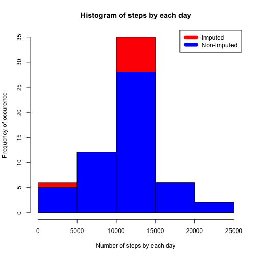

## Introduction
This analysis answers a series of questions using data collected from activity monitoring devices. Goal is to find the activity pattern from data.

## Dependencies

dplyr, knitr, lattice and markdown are required libraries


```r
is.installed <- function(mypkg) {
  is.element(mypkg, installed.packages()[,1])
}

if(!is.installed("dplyr")) { install.packages("dplyr",quiet=TRUE, warn.conflicts=FALSE) }
if(!is.installed("knitr")) { install.packages("markdown",quiet=TRUE) }
if(!is.installed("lattice")) { install.packages("lattice",quiet=TRUE) }
if(!is.installed("markdown")) { install.packages("markdown",quiet=TRUE) }

suppressMessages(library(dplyr))
suppressMessages(library(markdown))
suppressMessages(library(knitr))
suppressMessages(library(lattice))
```

## Loading and preprocessing the data

Acitivity files are downloaded from the following location [Activity](http://d396qusza40orc.cloudfront.net/repdata%2Fdata%2Factivity.zip) and read into a table using dplyr.


```r
activityZip <- tempfile()
download.file("http://d396qusza40orc.cloudfront.net/repdata%2Fdata%2Factivity.zip", activityZip)
unzip(activityZip)
unlink(activityZip)
activityDF <- tbl_df(read.csv("activity.csv", header=TRUE))
```

Preprocess data read by grouping activity by date

```r
stepsByDate <- summarize(na.omit(group_by(activityDF, date)), totalsteps=sum(steps))
stepsByInterval <- summarize(na.omit(group_by(activityDF, interval)), averagesteps=mean(steps))
```

## What is mean total number of steps taken per day?

### Histogram of the total number of steps taken each day

```r
hist(stepsByDate$totalsteps, main="Histogram of steps by each day", col = "green", xlab="Number of steps by each day", ylab="Frequency of occurence")
```

 

### Mean and Median total number of steps taken each day

Mean of total number of steps taken each day is: 1.0766189 &times; 10<sup>4</sup>

Median of total number of steps taken each day is: 10765

## What is the average daily activity pattern?


```r
plot(stepsByInterval$interval, stepsByInterval$averagesteps, type="l", xlab="Interval", ylab="Number of Steps", main="Average number of steps each day per interval")
```

 

Maximum steps for an interval is 835 

## Imputing missing values
Missing data is imputed by taking averages and replacing NA values with them.

Number of unknown intervals or missing data is:  2304

Replacing NA values in steps by average of steps for that interval during all days.

```r
activityDFImputed <- transform(activityDF, steps = ifelse(is.na(activityDF$steps), stepsByInterval$averagesteps[match(activityDF$interval, stepsByInterval$interval)], activityDF$steps))
```

Impute zeros for 10-01-2012 NA values.

```r
activityDFImputed[as.character(activityDFImputed$date) == "2012-10-01", 1] <- 0
```

Number of unknown intervals or missing data now is:  0

###Histogram of total steps by day after imputing values

```r
stepsByDateImputed <- summarize(na.omit(group_by(activityDFImputed, date)), totalsteps=sum(steps))
hist(stepsByDateImputed$totalsteps, main="Histogram of steps by each day", col = "red", xlab="Number of steps by each day", ylab="Frequency of occurence")
hist(stepsByDate$totalsteps, main="Histogram of steps by each day", col = "blue", xlab="Number of steps by each day", ylab="Frequency of occurence", add=T)
legend("topright", c("Imputed", "Non-Imputed"), col=c("red","blue"), lwd=10)
```

 

###Mean and Median of imputed data 

Mean of total number of steps taken each day is: 1.0589694 &times; 10<sup>4</sup>

Median of total number of steps taken each day is: 1.0766189 &times; 10<sup>4</sup>

###Difference between imputed and non-imputed data (mean, median, total steps)

Difference in mean is: -176.4948964

Difference in median is: 1.1886792

Difference in total steps is: 7.5363321 &times; 10<sup>4</sup>

## Are there differences in activity patterns between weekdays and weekends?


```r
weekend <- c("Saturday", "Sunday")
activityDFImputed$typeofday = as.factor(ifelse(!is.element(weekdays(as.Date(activityDFImputed$date)),weekend), "Weekdays", "Weekend"))
stepsByIntervalImputed <- summarize(na.omit(group_by(activityDFImputed, interval, typeofday)), averagesteps=mean(steps))
xyplot(stepsByIntervalImputed$averagesteps ~ stepsByIntervalImputed$interval|stepsByIntervalImputed$typeofday, main="Average steps each day by Interval", xlab="Interval", ylab="Steps", layout=c(1,2), type="l")
```

 

